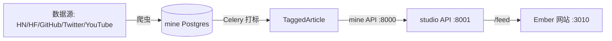

# Ember

全球 AI 信息聚合与智能加工平台：从全球信息流中采集、清洗、标注 AI 领域动态，并提供智能简报、知识库与可视化加工工作台。

## 项目结构

```
Ember/
├── mine/     # 内容聚合引擎（采集、清洗、AI 标注、定时任务）
└── studio/   # 工作台（FastAPI 后端 + Next.js 前端）
    └── web/  # Next.js 16 前端（Ember 界面）
```

## 本地启动

### 后端（Docker Compose）

```bash
cd mine
cp .env.example .env   # 填入 OPENAI_API_KEY 等
docker compose up -d

cd ../studio
cp .env.example .env
docker compose up -d
```

- mine：API `http://localhost:8000`、RSSHub `http://localhost:1200`、nginx `http://localhost:80`
- studio：前端 `http://localhost:3010`、API `http://localhost:8001`、Qdrant `http://localhost:6333`

首次启动后需建表（上游未提供迁移脚本）：

```bash
cd studio && docker compose exec studio-api python -c "from sqlalchemy import create_engine; from studio.models import Base; import os; Base.metadata.create_all(create_engine(os.environ['DATABASE_URL_SYNC']))"
cd ../mine && docker compose exec mine-api python -c "from sqlalchemy import create_engine; from mine.models import Base; import os; Base.metadata.create_all(create_engine(os.environ['DATABASE_URL_SYNC']))"
```

### 前端开发

```bash
cd studio/web
npm install
npm run dev      # http://localhost:3000
```

## 数据源配置

数据源统一注册在 `mine/src/mine/seed.py`，由 `python -m mine.seed` 写入数据库，
Celery beat 每 5 分钟检查一次并按各自的 `poll_interval_seconds` 自动抓取。

| 数据源 | 爬虫类型 | 说明 |
| --- | --- | --- |
| Hacker News | `hn_api` | 官方 Firebase API，抓取 Top 30 帖子 |
| HuggingFace 论文榜 | `hf_api` (papers) | 官方 daily papers API |
| HuggingFace 模型榜 | `hf_api` (models) | 按 trendingScore 抓取 20 个热门模型 |
| GitHub Releases | `github_api` (releases) | 各开源仓库 Releases（OpenAI/Anthropic/LangChain 等） |
| Twitter/X | `twitter_api_io` | twitterapi.io（同 n8n 工作流），账号 OpenAI / GoogleDeepMind / GoogleAIStudio + AI 关键词搜索 |
| YouTube 频道 | `youtube_api` (channel) | RSSHub 本地实例优先，直连 YouTube RSS 兜底，频道：AI Explained / Matt Wolfe / Greg Isenberg |
| YouTube 热门 | `youtube_api` (search) | YouTube Data API v3 搜索 24h 内 AI 视频（需 API Key） |

### 需要的环境变量（`mine/.env`）

```bash
GITHUB_TOKEN=            # GitHub Releases 提高 API 限额（可选）
YOUTUBE_API_KEY=         # YouTube 热门视频搜索/统计（可选，频道 RSS 不需要）
TWITTERAPI_IO_KEY=       # twitterapi.io API Key（Twitter 数据源必需）
TWITTER_AUTH_TOKEN=      # RSSHub Twitter 路由用（可选）
RSSHUB_BASE_URL=http://rsshub:1200
RSSHUB_ACCESS_KEY=forge_mine_2026
```

未配置 `OPENAI_API_KEY` 时，打标任务自动使用规则兜底（按来源类型给出分类/标签/重要度），
数据依然会推送到网站；配置 Key 后升级为 LLM 打标与中文标题翻译。

手动触发单源抓取：

```bash
docker compose -f mine/docker-compose.yml exec mine-worker \
  python -c "from mine.celery_app import celery; celery.send_task('mine.tasks.crawl_source', args=['G-COMM-HN'])"
```

### 数据流向



生产构建：`npm run build && npm run start`

## 设计风格

界面采用 **Ember（炉火余烬）** 暖色设计系统：

- 默认暖暗色：炉渣炭黑画布 + 蜜色文字 + 余烬橘强调色
- 签名元素：热度条使用“余烬→琥珀”渐变，与“热度/重要性”语义绑定
- 亮色伴生模式为暖象牙白，暗色模式下仍保持温暖质感
- 设计令牌统一在 `studio/web/src/app/globals.css` 中定义，可一键整体换肤

## 技术栈

- mine：Python / FastAPI / Celery / PostgreSQL / Redis / RSSHub
- studio：Python / FastAPI / Qdrant / Celery + Next.js 16 / React 19 / Tailwind CSS 4
